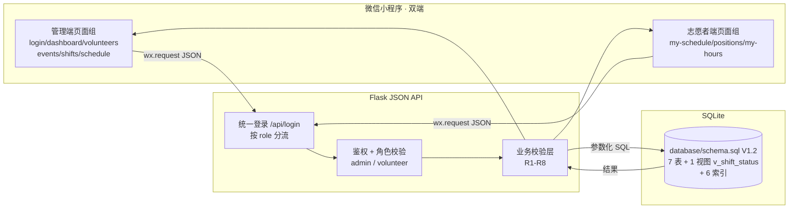
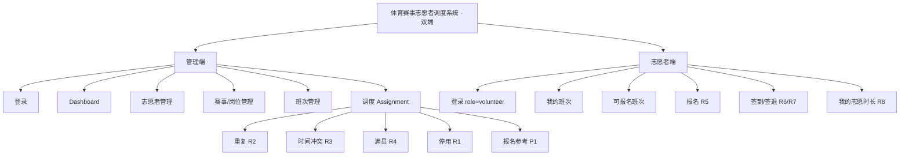
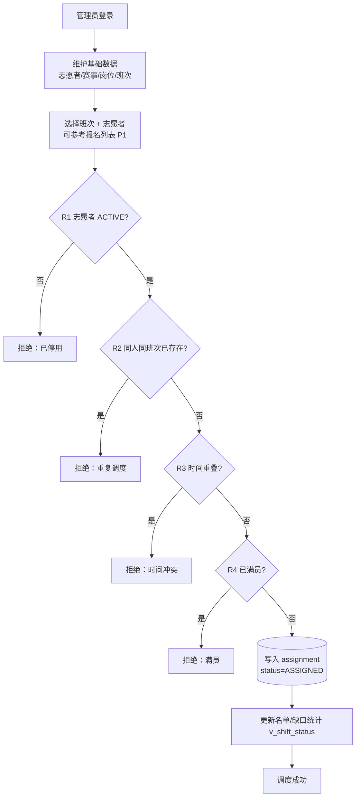
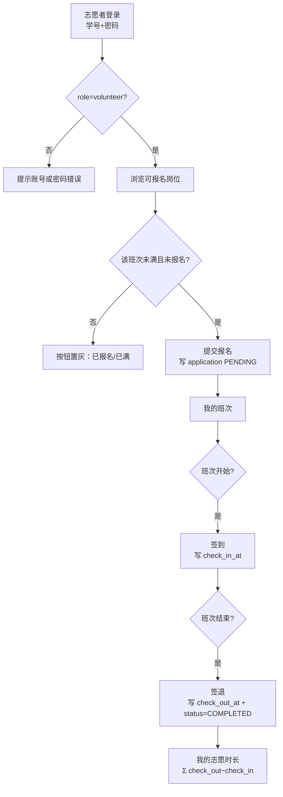
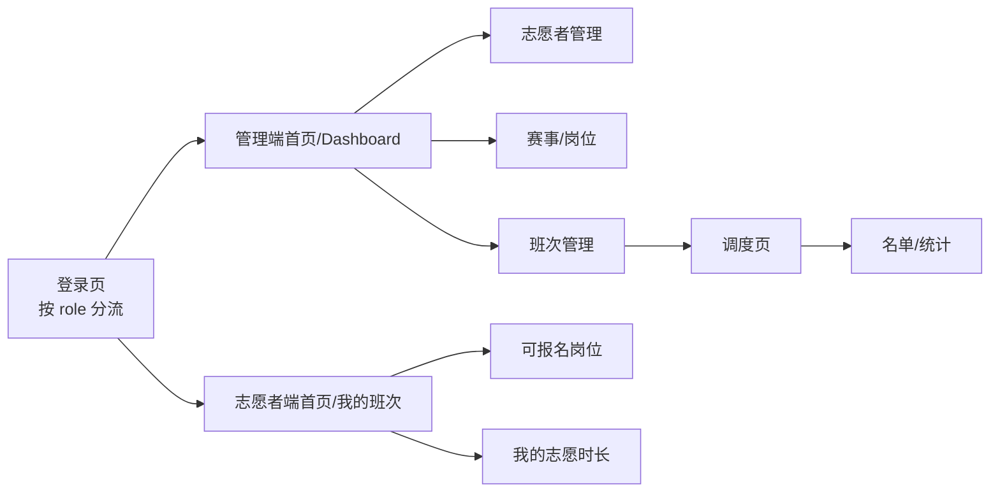

# 03 系统架构与流程图（报告/PPT 可直接使用 · 双端）

> 文档归属：刘腾罡（系统分析员）｜版本：V2｜2026-10-02
> 说明：图是前后端与数据库联调草案，只出现计划实现的模块。v2 新增双端与志愿者端流程。

## 1. 总体架构图

数据流向：**微信小程序（双端）→ Flask JSON API（Session 鉴权 + 角色分流）→ sqlite3 → SQLite**。

## 2. 功能模块图

## 3. 管理端调度业务流程图（Assignment 闭环）

## 4. 志愿者端业务流程图（v2 新增）

## 5. 页面流程图

## 6. 数据库课程重点速查（答辩用）

| 知识点 | 本项目落点 |
|---|---|
| 主键 PK / 外键 FK | 7 张表均 INTEGER PK；shift/assignment/application 含 FK |
| UNIQUE | student_no、role.name、UNIQUE(shift_id,volunteer_id)、UNIQUE(volunteer_id,shift_id) |
| CHECK | status 枚举（含 assignment 的 COMPLETED）、start<end、required_count>0、check_out_at>=check_in_at、COMPLETED 必须有签到签退时间 |
| JOIN | assignment/application 关联 volunteer/shift/event/role |
| 聚合 GROUP BY | v_shift_status；core_queries.sql 的时长/可报名聚合 |
| 视图 | v_shift_status（V1.2 唯一视图，含缺口统计） |
| 索引 | 6 个 idx_（含 idx_shift_time 复合索引） |
| 参数化 SQL | 所有接口 ? 占位符 |
| 双端会话 | session.role 分流，越权 403 |
